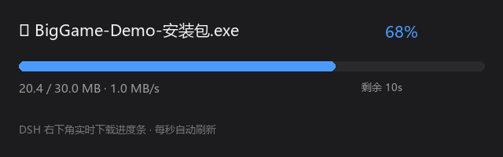

# ⬇️ dsh-download-progress

**DeepSeek Harness (DSH) 实时下载进度条** —— 下载文件时，右下角悬浮层每秒自动更新进度条（文件名 / 百分比 / 速度 / 剩余时间 / 完成态），无需手动刷新。

*Realtime download progress bar for DeepSeek Harness: a floating overlay that auto-refreshes every second showing file name / percent / speed / ETA — no manual refresh needed.*



## 功能

- 🖥️ 右下角悬浮层实时进度条，每秒自动轮询更新
- 📄 显示文件名、百分比、已下载/总大小、速度、剩余时间
- ✅ 完成态变绿显示「✅ 下载完成」，错误态显示原因
- 🔄 下载工具支持断点续传、HTTP 重定向跟随、GitHub 镜像加速

## 组成

| 文件 | 说明 |
| --- | --- |
| `download.cjs` | 带进度的下载工具（Node.js，写状态到 `~/.dsh/downloads/active.json`） |
| `plugin-definition.json` | DSH 动态 Cordis 插件定义（进度条 UI） |

## 安装

### 1. 下载工具

```bash
# 放到 DSH 脚本目录
cp download.cjs ~/.dsh/scripts/download.cjs
```

### 2. 进度条插件

在 DSH 会话中通过动态插件加载（cordis_define / cordis_run），定义内容见 `plugin-definition.json`：
- Host 端：注册 `dl-status` RPC，读取 `~/.dsh/downloads/active.json`
- Client 端：注册 `shell.overlay` 悬浮层，每秒 `host.call('dl-status')` 轮询刷新

> ⚠️ 如果进度条一直显示「待命」，可能是 `fs.resolve('~/.dsh/...')` 未展开 `~`，把 Host 代码里的路径改为绝对路径（如 `C:/Users/<你>/.dsh/downloads/active.json`）。

## 使用

```bash
# 基础下载（自动显示进度条）
node ~/.dsh/scripts/download.cjs <URL> <输出路径>

# GitHub 大文件国内加速（镜像）
node ~/.dsh/scripts/download.cjs <URL> <输出路径> --mirror=https://gh-proxy.com/
```

下载开始后，右下角自动弹出进度条；完成后回到「待命」状态。

## 国内下载加速

GitHub 大文件国内直连常超时，推荐镜像（响应快但偶发不稳定）：
- `https://gh-proxy.com/`
- `https://ghfast.top/`
- `https://ghproxy.net/`

## 踩坑记录

- **drain 恢复作用域**：下载工具的 `res.on('drain')` 恢复必须在 `res` 回调作用域内注册，否则报 `ReferenceError: res is not defined`
- **动态 client 无 setInterval**：DSH 动态客户端没有浏览器定时器全局，必须用 `timer` 服务的 `ctx.interval`，且插件需 `inject: ['timer']`
- **限速无效**：`pause/resume` 节流对 Node 大缓冲无效，已移除限速功能

## License

MIT
